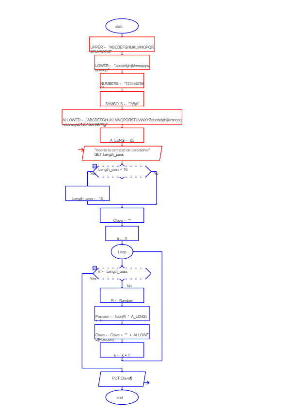
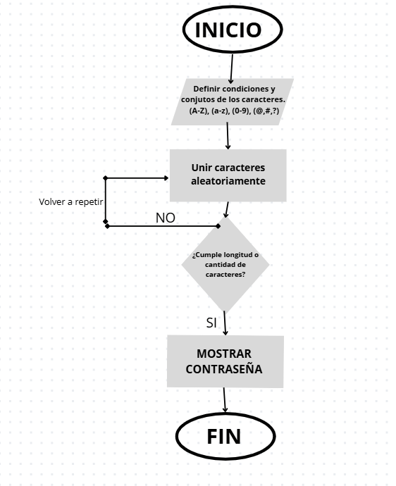

# Generador-de-claves
## Nombre: Diego Alejandro Medina Sánchez 
## Ingeniería en Software 
## Trabajo Autónomo 2
### Fecha: 19 de octubre de 2025 

Es un generador de claves de 16 o más caracteres, es decir 80 o más bits, que lo genera de forma aleatoria utilizando mayúsculas, minúsculas, números y símbolos. A esto se le considera una contraseña segura, debido a que pasado los 80 bits, esto debido a que la entropía mide el grado de aleatoriedad o denominado incertidumbre de una contraseña, es decir mientras más entropía es más difícil predecir. Este se mide por bits, y cada bit duplica el número posible de combinaciones, es decir 1 bit tiene 2 combinaciones, 2 bits 4 combinaciones y así sucesivamente. En este caso fue fijado los conjuntos y la suma del abecedario en mayúscula, minúscula, números y símbolos era 65, es decir cada puesto tiene 65 combinaciones y la cantidad de caracteres que mínimo será 16, esto se puede escribir cómo un logaritmo: Entropía=log2​(6516)=16×log2​(65)= 6022x16= 96.35 bits . O es igual a que contenga 79 trillones de combinaciones.

Se generará una app donde el código se realizará de esta forma: 

a.	Dentro de la app definirá condiciones como la longitud de la contraseña (16 o más caracteres), además los conjuntos de caracteres permitidos cómo mayúsculos que serán (A-Z), minúsculas (a-z), números (0-9) y sólo con 3 símbolos (¿,#,@). 

b.	Otra condición es que la clave deberá contener de forma aleatoria cualquier carácter de cada conjunto presentado anteriormente. 

c.	Primeramente, la app pedirá que escribas un número igual o mayor a 16 para que te entregue una clave con esa cantidad de caracteres.

d.	Luego el código se definirá en unir de una forma aleatoria los 16 caracteres de cualquiera de estos conjuntos.

e.	Poner un paso dentro del código de repetir el proceso hasta tener la longitud deseada para asegurarnos no exista ningún error. 

f.	Luego se pondrá la función imprimir al usuario, para mostrar el resultado del código. 

g.	Esto se repetirá cada 60 días, para hacerlo más seguro e ir cambiando claves. 

# Diagramas 
## Diagrama RAPTOR

Aquí se muestra el diagrama de flujo creado en RAPTOR para el generador de claves.

### Visualización

### 📥 Archivo editable
Si deseas abrir o modificar el diagrama en RAPTOR, puedes descargar el archivo aquí:  
[Descargar diagrama RAPTOR (.rap)](Autónomo_2.rap)
### Diagrama de actividad simple

### Diagrama de Caso

